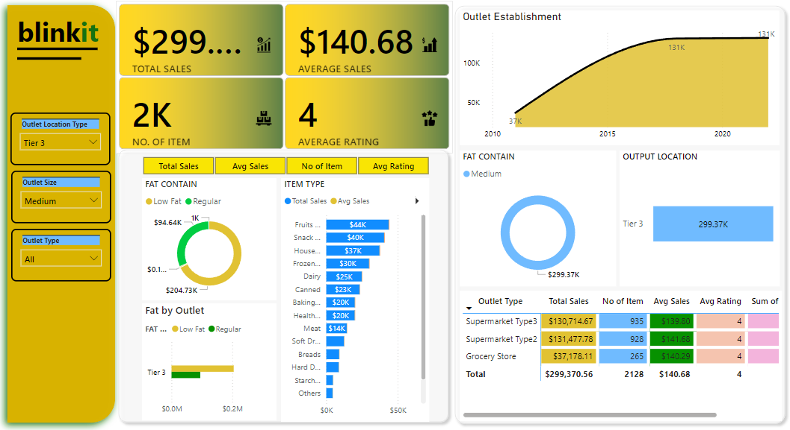

# Blinkit Grocery Analytics: From Data to Dashboard

This project focuses on analyzing sales data from **Blinkit Grocery** using Python for data analysis and statistical test (t-test, ANOVA, chi-square test), and **Power BI** for data visualization. The aim is to uncover key trends and insights from the sales data and provide an interactive dashboard for exploration and decision-making.

## Project Overview
This project involves:
- Analyzing grocery sales data using **Pandas** to clean, transform, and explore the dataset.
- Building a **Power BI dashboard** to visualize the insights derived from the analysis.

The Power BI dashboard provides an interactive interface that allows users to filter data and view detailed reports on sales trends, item types, and outlet performance.

## Data Analysis Workflow
The following steps were conducted during the analysis:

### 1. Data Preprocessing
- Loaded the sales dataset using **Pandas**.
- Handled missing values and standardized formats for the relevant columns.
- Ensured that the dataset was clean and ready for analysis.

### 2. Exploratory Data Analysis (EDA)
- Explored key features like `Item Weight`, `Sales`, `Item Type`, and `Outlet Establishment Year`.
- Performed **correlation analysis** to find relationships between different variables.
- Conducted descriptive statistics to understand the distribution of sales and item types.

### 3. Hypothesis Testing and Statistical Analysis
3.1. T-test (Low-Fat vs. Regular-Fat Sales)
- t_statistic: -0.514
- p_value: 0.607
- Interpretation: There is no statistically significant difference between the sales of low-fat and regular-fat items, as the p-value is greater than 0.05.

3.2. ANOVA (Sales by Item Type)
- F-statistic: 7.16
- p_value: 6.514e-16
- Interpretation: The low p-value indicates that there is a significant difference in sales between different item types.

3.3. Chi-square Test (Outlet Location Type vs. Outlet Type)
- Chi-square statistic: 4725.61
- p_value: 0.0
- Degrees of Freedom: 6
- Interpretation: The test shows a statistically significant relationship between outlet location type and outlet type, indicating that these two variables are dependent on each other.


### 4. Regression Analysis
- Applied a **linear regression model** to predict sales based on independent variables such as `Item Weight`, `Outlet Type`, and `Item Visibility`.
- Evaluated model performance using metrics like **R-squared** and **Mean Squared Error (MSE)**.

### 5. Power BI Dashboard Design
- Designed an interactive **Power BI dashboard** to present the findings and insights from the analysis.
- Visualizations include:
  - **Total Sales by Outlet Type**
  - **Average Sales per Outlet**
  - **Sales Trends Over Time**
  - **Item Type Breakdown by Sales**
  - **Fat Content Analysis**
  - **Outlet Performance Metrics**

## Power BI Dashboard Overview



The Power BI dashboard provides the following key insights:
- **Total Sales**: Displays the total sales across all outlets.
- **Average Sales**: Shows the average sales per outlet and per item.
- **No. of Items**: Represents the total number of items sold.
- **Fat Content by Outlet**: Visualizes the sales distribution by fat content (Low Fat vs. Regular).
- **Outlet Establishment Trends**: Tracks the sales growth by the outlet establishment year.
- **Item Type Breakdown**: Provides a detailed look at sales across different item types.

## Tools and Technologies Used
- **Python (Pandas)**: Used for data cleaning, preprocessing, and analysis.
- **Power BI**: Used for interactive dashboard creation and data visualization.
- **Jupyter Notebook**: Used to run the Python analysis and perform calculations.

## Getting Started

To run the analysis on your local system:

1. **Clone the repository**:
   ```bash
   git clone https://github.com/Nazmul92/data-analysis-python/blinkit-data-analysis.git
   cd blinkit-data-analysis
   ```
2. **Install required Python libraries:**:
   ```bash
   pip install pandas numpy matplotlib seaborn
   ```
3. **Open and run the Jupyter notebook**:
   - Use Jupyter Notebook to open and run the `blinkit-data-analysis.ipynb` file. This file contains the entire data analysis workflow, including data cleaning, exploratory analysis, and regression modeling.

4. **Power BI Dashboard**:
   - Open the provided `.pbix` file in **Power BI Desktop** to explore the interactive dashboard. The dashboard provides insights into total sales, average sales, sales by item type, outlet performance, and more.
## Conslusion
This project demonstrates how data analysis and visualization can provide valuable insights into sales performance. The Power BI dashboard enables stakeholders to make data-driven decisions and optimize sales strategies based on interactive, real-time data exploration.

Feel free to explore the repository and reach out if you have any questions or suggestions!
